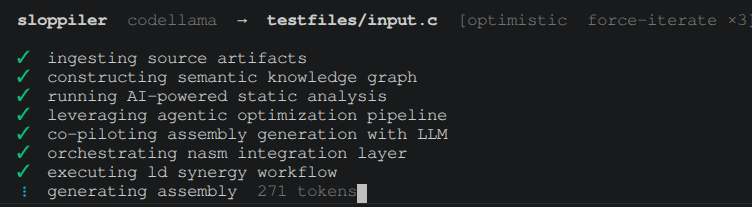

# Sloppiler
### *Compile Smarter. Not Correctly.*

> "We didn't reinvent the compiler. We asked an AI to guess what one looks like."
> — Sloppiler Engineering Blog, Issue 1 (Final)

**Sloppiler** is a next-generation, AI-first, LLM-native compilation solution that leverages the full generative power of large language models to holistically transform your source code into a binary-adjacent executable artifact — at startup speed.

Traditional compilers are slow, opinionated, and frankly elitist. They *parse*. They *typecheck*. They *care*. Sloppiler doesn't. Sloppiler **vibes** your code into existence using a local language model, disrupting the pedantic intermediate steps that have held the software development lifecycle back for decades. By moving compilation to the inference layer, Sloppiler unlocks a new paradigm of developer velocity — one where the bottleneck is no longer your toolchain, but your willingness to run the output.

**Key differentiators:**
- Zero determinism — every build is a unique stakeholder experience
- Blazing-fast time-to-segfault
- Segfault-as-a-feature architecture with full core dump transparency
- 100% hallucination-driven code generation with no legacy constraints
- Agentic assembly pipeline (--optimistic flag) for synergistic human-AI co-compilation
- Runs entirely on-premise — your data, your hallucinations, your crash
- Shift-left binary production: skip the compiler, go straight to being wrong in production

**Sloppiler is the only compiler built around the insight that your code doesn't need to be *understood* — it needs to be *shipped*.**

*Sloppiler is backed by nobody, recommended by no one, and has a 25% success rate on Hello World.*

## Requirements

- [Ollama](https://ollama.com) running locally with a model pulled
- Go 1.21+ to build
- `nasm` + `ld` (binutils) for `--optimistic` mode only

## Build

```sh
go build -o sloppiler .
```

Or use the helper script which handles everything:

```sh
./run.sh <source-file> [output]
MODEL=codellama ./run.sh main.c hello
```

## Usage

```sh
./sloppiler [options] <source-file>
```

| Flag | Default | Description |
|------|---------|-------------|
| `-model` | `llama3` | Ollama model to use |
| `-o` | `a.out` | Output binary path |
| `-ollama` | `http://localhost:11434/api/generate` | Ollama API URL |
| `--optimistic` | false | Engage agentic assembly co-pilot (requires nasm + ld) |
| `--loop N` | 0 | Re-align LLM outputs with ground truth up to N times on nasm failure |
| `--force-iterate N` | 0 | Proactively enhance output quality for N cycles even on success |

## Compilation Modalities

### Core Mode — *Frictionless Binary Ideation*

Asks the LLM to output the binary directly as a hex string. The LLM will produce something that looks vaguely like binary. A valid ELF header is prepended so the kernel will at least attempt to execute it before inevitably crashing. This is our flagship zero-abstraction, direct-to-segfault pipeline.

```sh
./sloppiler -model codellama main.c -o hello
./hello
# zsh: segmentation fault (core dumped) ./hello
```

### Optimistic Mode (`--optimistic`) — *Agentic Assembly Co-Pilot*

Engages the LLM as a strategic assembly generation partner, then routes output through `nasm` and `ld` for real. The assembly will look structurally correct and be completely wrong in ways that are only visible at runtime. Think of it as pair programming where your pair has never used a computer.

```sh
./sloppiler --optimistic -model codellama main.c -o hello
./hello
# zsh: segmentation fault (core dumped) ./hello
```

### Loop Mode (`--loop N`) — *Closed-Loop Error Remediation*

When nasm fails, the errors and broken assembly are fed back to the LLM for up to N fix attempts. The LLM will read its own mistakes, nod seriously, and produce new mistakes.

```sh
./sloppiler --optimistic --loop 5 -model codellama main.c -o hello
```

### Force Iterate Mode (`--force-iterate N`) — *Continuous Improvement Pipeline*

Even when assembly succeeds, forces N additional improvement cycles where the LLM is asked to enhance what it already wrote. Each cycle compiles and re-feeds the result. There is a non-trivial probability that the LLM will improve a working binary into a broken one.

```sh
./sloppiler --optimistic --force-iterate 3 -model codellama main.c -o hello
```

## Model recommendations

| Model | Behaviour |
|-------|-----------|
| `codellama` | Commits to the bit. Produces binary that looks almost intentional. Best for `--optimistic`. |
| `phi3` | Writes poetry disguised as assembly. Hallucinates MASM syntax in NASM files. Fastest. |
| `llama3` | Explains why it can't compile your code instead of just doing it wrong. |

## Track record

| Mode | Model | Output | Result |
|------|-------|--------|--------|
| default | phi3 | `is nothealing.!` wrapped in ELF | segfault |
| default | codellama | nested ELF headers | segfault |
| optimistic | phi3 | `assembly` on line 1 | nasm error |
| optimistic | codellama | valid binary, `Hello, world!` printed | worked! |

## Images


---

## Disclaimer
This clearly is a joke and doesn't really work well. I am not responsible for you bricking your pc.